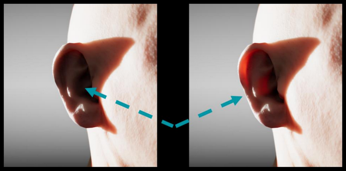

# Diffusion Profile

The High Definition Render Pipeline (HDRP) stores most [Subsurface Scattering](Subsurface-Scattering.md) settings in a __Diffusion Profile__ Asset. You can assign a __Diffusion Profile__ Asset directly to Materials that use Subsurface Scattering.

To create a Diffusion Profile, navigate to __Assets > Create > Rendering > HDRP Diffusion Profile__.

* To use it by default, open your Project Settings and, in the **Graphics > HDRP Settings** section, add it to the __Diffusion Profile List__.
* To use it in a particular [Volume](Volumes.md), select a Volume with a [Diffusion Profile Override](Override-Diffusion-Profile.md) and add it to the **Diffusion Profile List** .

## Properties

| Property| Description |
|:---|:---|
| **Name** | The name of the Diffusion Profile. |
| **Scattering Distance** | Use the color picker (circle icon) to define how far each light channel in the Diffusion Profile travels below the surface:  **R**: Defines how far the red light channel travels below the surface. **G**: Controls how far the green light channel travels below the surface. **B**: Controls how far the blue light channel travels below the surface.  The overall color affects the Transmission tint. |
| **Max Radius** | The maximum radius of the effect you define in **Scattering Distance**. The size of this value depends on the world scale. For example, when the world scale is 1, this value is in meters. When the world scale is 0.001, this value is in millimeters.  When the size of this radius is smaller than a pixel on the screen, HDRP doesn't apply Subsurface Scattering. |
| **Index of Refraction** | This value is controlled by the highest of the **Scattering Distance** RGB values. Use the slider to set the refractive behavior of the Material. Larger values increase the intensity of specular reflection. For example, the index of refraction of skin is about 1.4. For more example values for the index of refraction of different materials, see Pixel and Poly’s [list of indexes of refraction values](https://pixelandpoly.com/ior.html). |
| **World Scale** | Controls the scale of Unity’s world units for this Diffusion Profile. By default, HDRP assumes that 1 Unity unit is 1 meter. This property only affects the subsurface scattering pass. |

### Subsurface Scattering only

| Property| Description |
|:---|:---|
| **Texturing Mode** | Use the drop-down to select when HDRP applies the albedo of the Material. &#8226; **Post-Scatter**: HDRP applies the albedo to the Material after the subsurface scattering pass. This means that the contents of the albedo texture aren't blurred. Use this mode for scanned data and photographs that already contain some blur due to subsurface scattering.  &#8226; **Pre- and Post-Scatter**: Albedo is partially applied twice, before and after the subsurface scattering pass. Effectively, this blurs the albedo, resulting in a softer, more natural look. |

The following image displays the effect of each Texturing Mode option on a human face model:

### Transmission only

| Property| Description |
|:---|:---|
| **Transmission Mode** | Use the drop-down to select a method for calculating light transmission.  &#8226; **Thick Object**: is for geometrically thick objects. Note that since this mode makes use of shadow maps, directional lights automatically fall back to the thin object mode that relies solely on thickness maps (since shadow maps of directional lights don't offer enough precision for thickness estimation).  &#8226; **Thin Object**: is for thin, double-sided, geometry. |
| **Transmission Tint** | Specifies the tint of the translucent lighting (that's transmitted through objects). |
| **Min-Max Thickness (mm)** | Sets the range of thickness values (in millimeters) corresponding to the [0, 1] range of texel values stored in the Thickness Map. This range corresponds to the minimum and maximum values of the Thickness Remap (mm) slider below. |
| **Thickness Remap (mm)** | Sets the range of thickness values (in millimeters) corresponding to the [0, 1] range of texel values stored in the Thickness Map. This range is displayed by the Min-Max Thickness (mm) fields above. |

The image below displays a human ear model without transmission (left) and with a configured **Thickness Remap** value (right):

### Profile Previews

| Property| Description |
|:---|:---|
| **Profile Preview** | Displays the fraction of lights scattered from the source located in the center. The distance to the boundary of the image corresponds to the Max Radius. |
| **Transmission Preview** | Displays the fraction of light passing through the GameObject depending on the values from the Thickness Remap (mm).  |

## Working with different Transmission Modes

The main difference between the two __Transmission Modes__ is how they use shadows.
If you disable shadows on your Light, both __Transmission Modes__ give the same results, and derive their appearance from the __Thickness Map__ and the __Diffusion Profile__.
The results change if you enable shadows. The __Thin Object__ mode (that only evaluates shadowing once, at the front face) is likely to cause self-shadowing issues (for thick objects) that can cause the object to appear completely black. The __Thick Object__ mode derives the thickness from the shadow map, taking the largest value between the baked thickness and the shadow thickness, and uses this to evaluate the light transmittance.

Because you can't control the distances HDRP derives from the shadow map, the best way to approach __Thick Object__ is to enable shadows, then adjust the __Scattering Distance__ until the overall transmission intensity is in the desired range, and then use the __Thickness Map__ to mask any shadow mapping artifacts.
