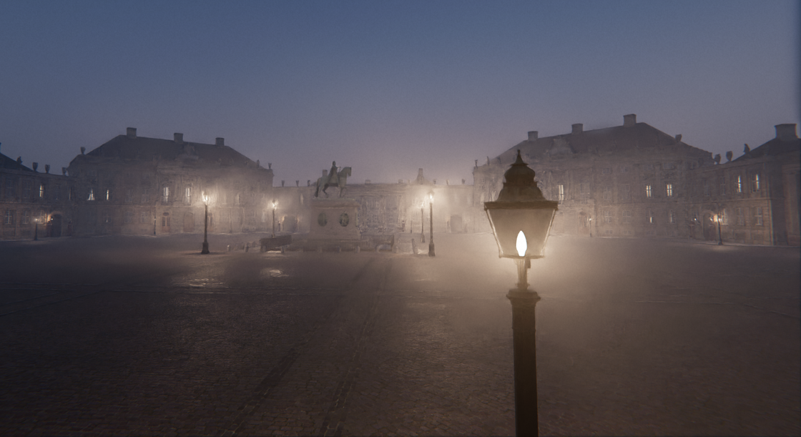

# Path tracing reference

## Properties

| Property                    | Description                                                  |
| --------------------------- | ------------------------------------------------------------ |
| **State**                   | When set to **Enabled**, HDRP uses path tracing.             |
| **LayerMask**               | Specifies the layers that path tracing includes.             |
| **Maximum Samples**         | Set the number of frames to accumulate for the final image. There is a progress bar at the bottom of the Scene view which indicates the current accumulation with respect to this value. |
| **Minimum Depth**           | Set the minimum number of light bounces in each path.        |
| **Maximum Depth**           | Set the maximum number of light bounces in each path. You can not set this to be lower than Minimum Depth.  **Note**: You can set this and Minimum Depth to 1 if you only want to direct lighting. You can set them both to 2 if you only want to visualize indirect lighting (which is only visible on the second bounce). |
| **Maximum Intensity**       | Set a value to clamp the intensity of the light value each bounce returns. This avoids bright, isolated pixels in the final result. **Note**: This property can make the final image dimmer, so if the result looks dark, increase the value of this property. |
| **Sky Importance Sampling** | Set the sky sampling mode. Importance sampling favors the brightest directions, which is beneficial when using a sky model with high contrast and intense spots (like a sun, or street lights). On the other hand, it can be slightly detrimental when using a smooth, uniform sky. It's active by default for HDRI skies only, but can also be turned On and Off, regardless of the type of sky in use. |
| **Seed Mode**               | Set how the path tracer generates random numbers. The seed is the pattern the noise has. When accumulating samples, every frame needs a different seed. Otherwise, the same noisy image gets accumulated over and over.  **Seed Mode** has the following options: &#8226; **Non Repeating**: This is the default option. The seed is chosen based on the camera frame count. When the accumulation resets, it is not reset to zero.  &#8226; **Repeating**: The seed is reset every time the accumulation is reset. Rendering of every image is done using the same random numbers. &#8226; **Custom**: Set the seed using a custom script. For more information, see the example in [Understand path tracing](path-tracing-understand.md).|
| **Denoising**               | Denoises the output of the the path tracer. This setting is only available when you install the **Unity Denoising** Package. **Denoising** has the following options: &#8226; **None**: Does not denoise (this is the default option). &#8226; **Intel Open Image Denoise** : Uses the Intel Open Image Denoise library to denoise the frame. &#8226; **NVIDIA OptiX** : Uses NVIDIA OptiX to denoise the frame.  You can also enable the following additional settings: &#8226; **Use AOVs** (Arbitrary Output Variables): Increases the amount of detail kept in the frame after HDRP denoises it. &#8226; **Temporal**: Improves the temporal consistency of denoised frame sequences. &#8226; **Separate Volumetric Fog**: Denoises the volumetric scattering effect separately for a smoother fog. When Separate Volumetric Fog is enabled, the Temporal setting will not improve volumetric fog temporal stability. |

**Minimum Depth** set to 1, **Maximum Depth** set to 2: direct and indirect lighting (1 bounce)

**Minimum Depth** set to 1, **Maximum Depth** set to 1: direct lighting only

**Minimum Depth** set to 2, **Maximum Depth** set to 2: indirect lighting only (1 bounce)

**Denoising** set to NVIDIA Optix, **Separate Volumetric Fog** set to Off

**Denoising** set to NVIDIA Optix, **Separate Volumetric Fog** set to On
